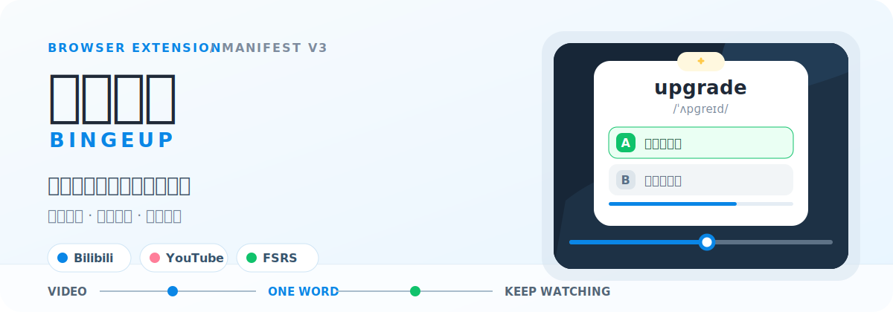
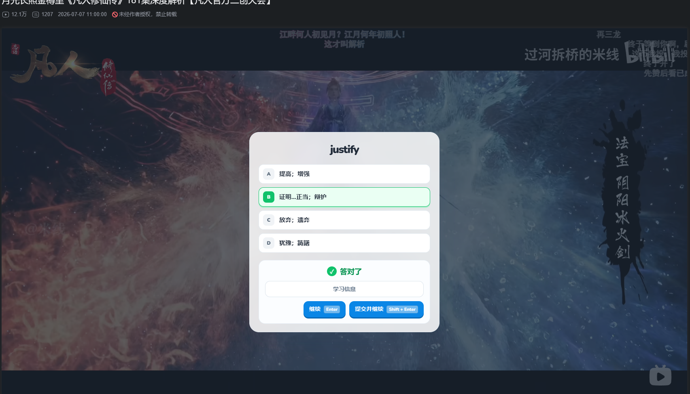
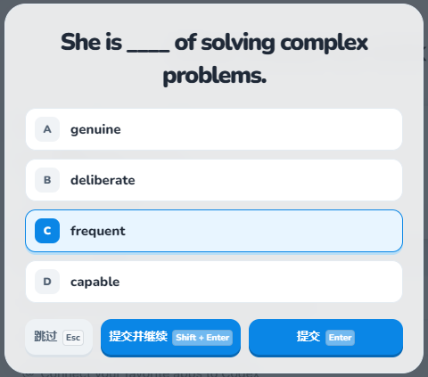
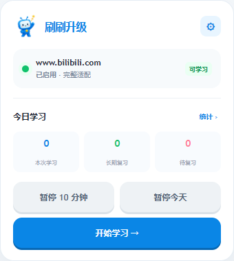
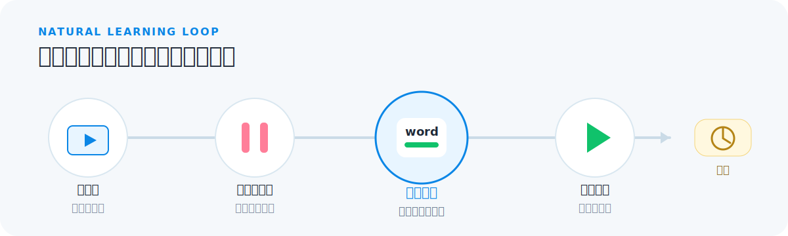

<p align="center">
  
</p>

<p align="center">
  <strong>刷着刷着，就升级了。</strong><br>
  一款把轻量英语学习放进视频自然间隙的浏览器扩展。
</p>

<p align="center">
  Chrome / Edge · Bilibili / YouTube · React + TypeScript · Apache-2.0
</p>

## 先看它怎么工作

当你进入新视频，刷刷升级会暂停主视频并盖上一道轻量学习题。答完或跳过后，视频从原进度继续；如果你想多学几题，也可以主动进入连续学习。

<p align="center">
  
</p>

<p align="center"><sub>真实运行截图：答题浮层覆盖在主视频区域，反馈完成后恢复播放。</sub></p>

<p align="center">
  
</p>

<p align="center"><sub>题目近景：可单题完成，也可「提交并继续」进入连续学习。</sub></p>

<p align="center">
  
</p>

<p align="center">
  
</p>

## 学习被放在间隙里，而不是待办清单里

- **自然触发**：进入新视频时出现学习界面；长视频定时学习由用户主动开启。
- **轻量完成**：新词展示、选择题和拼写题都在浮层内完成，不离开当前页面。
- **到期优先**：长期复习由 FSRS 调度；没有到期复习时再展示候选新词。
- **懂得退后**：正常完成后进入全局冷却，连续跳过会逐级延长冷却。
- **随时多学**：选择“提交并继续”即可保持视频暂停，连续处理多个学习项目。

<p align="center">
  
</p>

## 现在可以做什么

| 场景 | 能力 |
| --- | --- |
| 视频学习 | Bilibili 与 YouTube 的普通视频、竖屏视频和直播识别 |
| 学习内容 | 日常高频、四级、六级三套内置词库，可选择学习水平 |
| 题型 | 英选中、中选英、例句语境选择与拼写题 |
| 复习 | 新词短期巩固 + FSRS 长期复习调度 |
| 节奏 | 默认冷却、连续跳过降频、全局暂停、连续学习 |
| 数据 | 今日统计、导出、恢复备份、清除学习进度或全部数据 |

> [!NOTE]
> 学习进度、设置与复习记录保存在浏览器本地。内置词库随扩展提供，不会混入用户备份。

## 本地安装

当前仓库尚未发布预编译 Release。最短可用路径是从源码构建：

```bash
git clone https://github.com/F1rstDan/BingeUp.git
cd BingeUp
npm install
npm run build
```

然后在 Chrome 或 Edge 中：

1. 打开扩展管理页：Chrome 为 `chrome://extensions/`，Edge 为 `edge://extensions/`。
2. 开启「开发者模式」。
3. 点击「加载已解压的扩展程序」。
4. 选择构建产物目录 `.output/chrome-mv3`；Edge 构建请先运行 `npm run build:edge`，再选择 `.output/edge-mv3`。
5. 打开 Bilibili 或 YouTube，完成首次引导后进入一个视频。

## 开发

前置要求：Node.js 22+。

```bash
npm install          # 安装依赖
npm run dev          # Chrome 开发模式，支持 HMR
npm run typecheck    # TypeScript 类型检查
npm test             # 运行测试
npm run lint         # ESLint 检查
npm run build        # Chrome 生产构建
```

<details>
<summary><strong>全部项目命令</strong></summary>

| 用途 | 命令 |
| --- | --- |
| Chrome 开发模式 | `npm run dev` |
| Edge 开发模式 | `npm run dev:edge` |
| 类型检查 | `npm run typecheck` |
| 单元 / 集成测试 | `npm test` |
| 测试监听 | `npm run test:watch` |
| Lint 检查 / 修复 | `npm run lint` / `npm run lint:fix` |
| 格式化 / 检查 | `npm run format` / `npm run format:check` |
| Chrome / Edge 构建 | `npm run build` / `npm run build:edge` |
| 打包 zip | `npm run zip` |

</details>

项目基于 [WXT](https://wxt.dev/)、React 18、TypeScript、IndexedDB、[ts-fsrs](https://github.com/open-spaced-repetition/ts-fsrs) 与 Manifest V3。领域术语见 [CONTEXT.md](./CONTEXT.md)，架构决策见 [docs/adr](./docs/adr)。

## License

[Apache License 2.0](./LICENSE)
